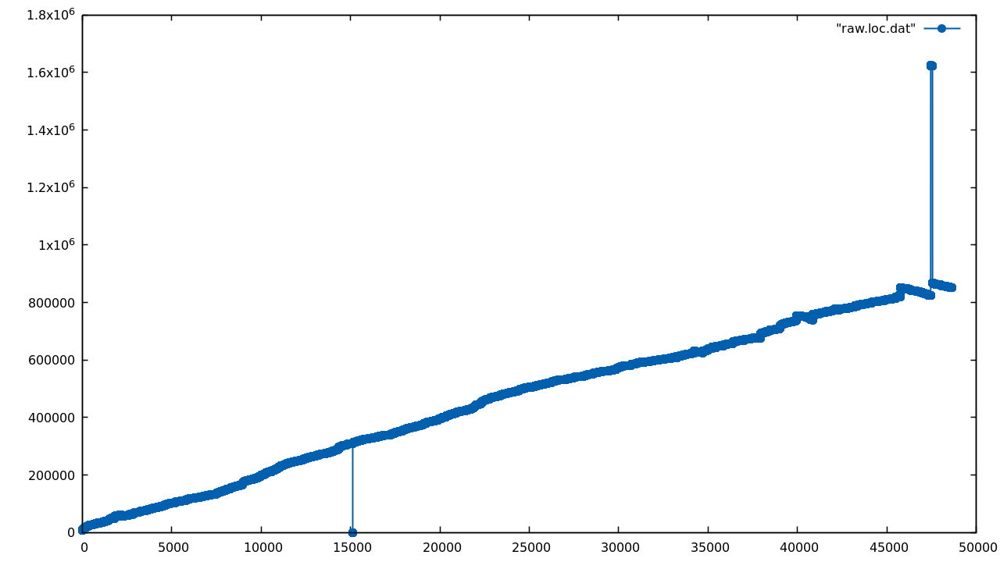

# Random SerenityOS Statistics

The contents of this repo are updated once a day.

The currently available statistics are:

- Lines of Code vs. Commits (data [here](data/loc.json))

    

- Performance trend of tests (starting at commit https://github.com/SerenityOS/serenity/tree/caecb6ba72ab9bff2f8ae4950fa1ae68651a3931, snapshot daily)
    
    See [Here](view/benchmarks)
